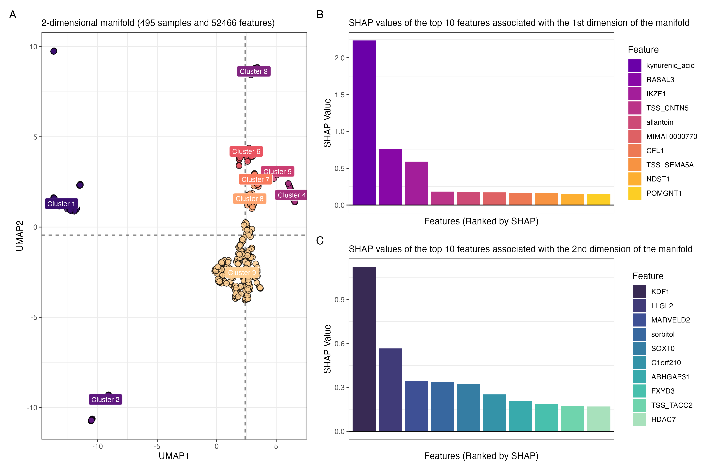

# Unveiling Complex Biological Networks through Advanced UMAP-Driven Multi-Omics Integration

 

## Introduction

This repository represents a substantial extension and refinement of the benchmarking framework originally established by [Cantini et al.](https://github.com/cantinilab/momix-notebook). Our repository builds upon their foundational work in benchmarking multi-omics integration methods, introducing the Group Aggregation via UMAP Data Integration (GAUDI) approach.    

In our study, we have meticulously selected methods for benchmarking based on their distinguished performance as identified in the research by [Cantini et al.](https://www.nature.com/articles/s41467-020-20430-7). This selection enabled a robust and meaningful comparison within the realm of state-of-the-art multi-omics integration techniques. Our approach, GAUDI, was rigorously tested against these well-established methods in a series of comprehensive benchmarks. By doing so, we aimed to not only validate GAUDI's efficacy but also to provide an in-depth, comparative perspective that could potentially open new avenues in multi-omics research.     

## Benchmark Scenarios

  - Comparison on artificial datasets: [`01_comparisons_on_simulated_data.qmd`](https://github.com/hirscheylab/umap_multiomics_integration/blob/main/scripts/01_comparisons_on_simulated_data.qmd)
  
  - Comparison on TCGA cancer datasets:
    - Survival, biological, and clinical annotations: [`02_comparison_on_cancer_data.qmd`](https://github.com/hirscheylab/umap_multiomics_integration/blob/main/scripts/02_comparison_on_cancer_data.qmd)  
    - Clusters: [`03_comparison_on_cancer_data_clusters.qmd`](https://github.com/hirscheylab/umap_multiomics_integration/blob/main/scripts/03_comparison_on_cancer_data_clusters.qmd)  
    
  - Comparison on single-cell datasets: [`04_comparison_on_single_cell_data.qmd`](https://github.com/hirscheylab/umap_multiomics_integration/blob/main/scripts/04_comparison_on_single_cell_data.qmd)
  
  - Comparison on DepMap datasets: [`05_comparison_on_DepMap_data.qmd`](https://github.com/hirscheylab/umap_multiomics_integration/blob/main/scripts/05_comparison_on_DepMap_data.qmd)
  
  - Benchmark of different UMAP integration methods (not included in the paper): [`umap_integration_methods.py`](https://github.com/hirscheylab/umap_multiomics_integration/blob/main/scripts/umap_integration_methods.py)

## Benchmark Methods

  - [Integrative NMF (intNMF)](https://pubmed.ncbi.nlm.nih.gov/28459819/) 
  - [Joint and individual variation explained (JIVE)](https://pubmed.ncbi.nlm.nih.gov/23745156/) 
  - [Multiple co-inertia analysis (MCIA)](https://pubmed.ncbi.nlm.nih.gov/15015753/) 
  - [Multi-Omics Factor Analysis (MOFA+)](https://pubmed.ncbi.nlm.nih.gov/32393329/)
  - [Regularized Generalized Canonical Correlation Analysis (RGCCA)](https://pubmed.ncbi.nlm.nih.gov/28536930/) 
  - [tensorial Independent Component Analysis (tICA)](https://pubmed.ncbi.nlm.nih.gov/29884221/)

## `gaudi` R Package

We have developed a comprehensive [R package for the GAUDI method](https://github.com/hirscheylab/gaudi), making it accessible and user-friendly for the research community. This package encapsulates all the functionalities of GAUDI, providing an efficient and streamlined way to apply our method to various multi-omics datasets.    

### Key Features

  - Easy integration of diverse omic data types
  - Implementation of advanced UMAP algorithms for dimensionality reduction
  - Built-in functions for clustering and feature extraction
  - Built-in functions for latent factors and metagenes visualization
  - Compatibility with standard bioinformatics workflows in R and Bioconductor

## Citation

